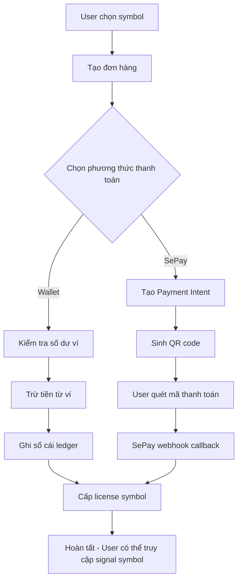

# 🎯 Hệ thống Mua Quyền Truy cập Symbol - API Documentation & Testing Guide

Hệ thống cho phép user mua quyền truy cập các mã chứng khoán (symbol) với 2 phương thức thanh toán: **Wallet** (ví nội bộ) hoặc **SePay Transfer** (chuyển khoản ngân hàng).

## 🔒 Validation & Security

### Kiểm tra số dư ví
- **Wallet Payment**: Hệ thống kiểm tra số dư ví TRƯỚC khi tạo đơn hàng
- Nếu số dư < tổng đơn hàng → **Báo lỗi ngay lập tức** 
- **SePay Payment**: Không kiểm tra số dư, tạo đơn hàng và chờ thanh toán

**Ví dụ validation:**
```
User có ví: 10,000 VND
Mua symbol giá: 100,000 VND
→ Kết quả: "Insufficient wallet balance. Required: 100000 VND, Available: 10000.00 VND"
```

## 📋 Tổng quan luồng



## 🏗️ Kiến trúc hệ thống

### Database Tables

#### 1. `pay_symbol_orders` - Đơn hàng
```sql
- order_id (UUID, PK)
- user_id (BIGINT) → users.id  
- total_amount (DECIMAL)
- status: pending_payment | paid | failed | cancelled | refunded
- payment_method: wallet | sepay_transfer
- description (TEXT)
- payment_intent_id (UUID) → pay_payment_intents.intent_id
- created_at, updated_at
```

#### 2. `pay_symbol_order_items` - Chi tiết sản phẩm
```sql
- order_item_id (UUID, PK)
- order_id (UUID) → pay_symbol_orders.order_id
- symbol_id (BIGINT) → symbol.id (Symbol được mua quyền truy cập)
- price (DECIMAL) 
- license_days (INT) - NULL = trọn đời
- metadata (JSON)
```

#### 3. `pay_user_symbol_licenses` - Quyền sử dụng symbol
```sql
- license_id (UUID, PK)
- user_id (BIGINT) → users.id
- symbol_id (BIGINT) → symbol.id
- order_id (UUID) → pay_symbol_orders.order_id
- status: active | expired | suspended | revoked
- start_at (TIMESTAMP)
- end_at (TIMESTAMP) - NULL = trọn đời
- created_at
```

#### 4. `pay_wallet_ledger` - Sổ cái ví (Updated)
```sql
- ledger_id (UUID, PK)
- wallet_id (UUID) → pay_wallets.wallet_id
- tx_type: deposit | purchase | refund | withdrawal | transfer_in | transfer_out
- amount (DECIMAL)
- is_credit (BOOLEAN) - true: cộng tiền, false: trừ tiền
- balance_before, balance_after (DECIMAL)
- order_id (UUID) → pay_symbol_orders.order_id [MỚI]
- payment_id (UUID) → pay_payments.payment_id
- note (TEXT) [MỚI]
- metadata (JSON)
- created_at
```

## 🔄 Chi tiết luồng hoạt động

### Bước 1: Tạo đơn hàng

**API:** `POST /api/seapay/symbol/order/create`

```json
{
  "items": [
    {
      "symbol_id": 123,          // ID của symbol (mã chứng khoán)
      "price": 500000,           // Giá bán (VND)
      "license_days": 30,        // Thời hạn sử dụng (null = trọn đời)
      "metadata": {
        "version": "v2.0",
        "features": ["signal", "backtest"]
      }
    }
  ],
  "payment_method": "wallet",    // "wallet" hoặc "sepay_transfer"
  "description": "Mua quyền truy cập Symbol Trading Scalping"
}
```

**Response:**
```json
{
  "order_id": "123e4567-e89b-12d3-a456-426614174000",
  "total_amount": 500000,
  "status": "pending_payment", 
  "payment_method": "wallet",
  "items": [...],
  "created_at": "2025-09-22T10:00:00Z",
  "message": "Order created successfully. Total: 500000 VND"
}
```

### Bước 2A: Thanh toán bằng Ví

**API:** `POST /api/seapay/symbol/order/{order_id}/pay-wallet`

**Luồng xử lý:**
1. Kiểm tra order status = `pending_payment`
2. Lấy wallet của user và kiểm tra balance
3. Validate: `wallet.balance >= order.total_amount`
4. Tạo ledger entry:
   ```
   tx_type: "purchase"
   is_credit: false  
   amount: order.total_amount
   balance_before: wallet.balance
   balance_after: wallet.balance - order.total_amount
   order_id: order.order_id
   ```
5. Cập nhật wallet balance
6. Cập nhật order status → `paid`
7. Tạo licenses cho từng item trong order

**Response:**
```json
{
  "success": true,
  "message": "Payment processed successfully",
  "order_id": "123e4567-e89b-12d3-a456-426614174000",
  "amount_charged": 500000,
  "wallet_balance_after": 1500000,
  "licenses_created": 1
}
```

### Bước 2B: Thanh toán bằng SePay

**API:** `POST /api/seapay/symbol/order/{order_id}/pay-sepay`

**Luồng xử lý:**
1. Tạo PaymentIntent với `purpose = "order_payment"`
2. Liên kết intent với order: `order.payment_intent = intent`
3. Sinh QR code với order_code từ intent

**Response:**
```json
{
  "intent_id": "456e7890-e89b-12d3-a456-426614174001",
  "order_code": "TOPUP1727001234ABCD", 
  "amount": 500000,
  "currency": "VND",
  "expires_at": "2025-09-22T11:00:00Z",
  "qr_code_url": "https://qr.sepay.vn/img?acc=96247CISI1&bank=BIDV&amount=500000&des=TOPUP1727001234ABCD&template=compact",
  "message": "Payment intent created. Please scan QR code to complete payment."
}
```

**Webhook Processing:**
Khi user thanh toán thành công, SePay gửi webhook → PaymentService xử lý → Trigger `BotPurchaseService.process_sepay_payment_completion()` → Cấp license.

### Bước 3: Cấp License

Sau khi thanh toán thành công (cả 2 phương thức), hệ thống tự động cấp license:

**Logic:**
```python
for item in order.items:
    start_at = now()
    end_at = start_at + timedelta(days=item.license_days) if item.license_days else None
    
    # Kiểm tra license existing
    existing_license = PayUserSymbolLicense.objects.filter(
        user=order.user, 
        symbol_id=item.symbol_id,
        status='active'
    ).first()
    
    if existing_license:
        # Extend license existing
        if existing_license.end_at and end_at:
            existing_license.end_at = max(existing_license.end_at, end_at)
        elif not end_at:  # New license is lifetime
            existing_license.end_at = None  # Upgrade to lifetime
        existing_license.save()
    else:
        # Tạo license mới
        PayUserSymbolLicense.objects.create(
            user=order.user,
            symbol_id=item.symbol_id,
            order=order,
            status='active',
            start_at=start_at,
            end_at=end_at
        )
```

## 🔍 API Endpoints

### Quản lý đơn hàng

| Method | Endpoint | Auth | Description |
|--------|----------|------|-------------|
| POST | `/api/seapay/symbol/order/create` | ✅ | Tạo đơn hàng mua quyền truy cập symbol |
| POST | `/api/seapay/symbol/order/{order_id}/pay-wallet` | ✅ | Thanh toán bằng ví |
| POST | `/api/seapay/symbol/order/{order_id}/pay-sepay` | ✅ | Tạo payment intent SePay |
| GET | `/api/seapay/symbol/orders/history` | ✅ | Lịch sử mua hàng |

### Quản lý quyền truy cập

| Method | Endpoint | Auth | Description |
|--------|----------|------|-------------|
| GET | `/api/seapay/symbol/{symbol_id}/access` | ✅ | Kiểm tra quyền truy cập symbol |
| GET | `/api/seapay/symbol/licenses` | ✅ | Danh sách license của user |

---

# 📮 Postman Testing Guide

## Chuẩn bị Environment

### 1. Tạo Environment Variables
```json
{
  "base_url": "http://localhost:8000",
  "access_token": "",
  "user_id": "",
  "order_id": "",
  "symbol_id": "123"
}
```

### 2. Authentication Headers
Tất cả requests cần header:
```
Authorization: Bearer {{access_token}}
Content-Type: application/json
```

## 🧪 Test Scenarios

### Scenario 1: Mua bot bằng Wallet

#### Step 1: Login để lấy access token
```http
POST {{base_url}}/api/auth/login
Content-Type: application/json

{
  "email": "user@example.com", 
  "password": "password123"
}
```

**Postman Test Script:**
```javascript
if (pm.response.code === 200) {
    const response = pm.response.json();
    pm.environment.set("access_token", response.access_token);
    pm.environment.set("user_id", response.user.id);
    console.log("✅ Login successful");
}
```

#### Step 2: Kiểm tra wallet balance
```http
GET {{base_url}}/api/seapay/wallet
Authorization: Bearer {{access_token}}
```

**Expected Response:**
```json
{
  "wallet_id": "123e4567-e89b-12d3-a456-426614174000",
  "balance": 2000000.00,
  "currency": "VND", 
  "status": "active"
}
```

#### Step 3: Tạo đơn hàng mua symbol
```http
POST {{base_url}}/api/seapay/symbol/order/create
Authorization: Bearer {{access_token}}
Content-Type: application/json

{
  "items": [
    {
      "symbol_id": {{symbol_id}},
      "price": 500000,
      "license_days": 30,
      "metadata": {
        "version": "v2.0",
        "package": "premium"
      }
    }
  ],
  "payment_method": "wallet",
  "description": "Mua Bot Trading Scalping - Test"
}
```

**Postman Test Script:**
```javascript
if (pm.response.code === 200) {
    const response = pm.response.json();
    pm.environment.set("order_id", response.order_id);
    console.log("✅ Order created:", response.order_id);
    console.log("💰 Total amount:", response.total_amount);
    
    // Validate response structure
    pm.test("Order created successfully", function() {
        pm.expect(response.status).to.eql("pending_payment");
        pm.expect(response.payment_method).to.eql("wallet");
        pm.expect(response.total_amount).to.eql(500000);
    });
}
```

#### Step 4: Thanh toán bằng wallet
```http
POST {{base_url}}/api/seapay/symbol/order/{{order_id}}/pay-wallet
Authorization: Bearer {{access_token}}
```

**Expected Response:**
```json
{
  "success": true,
  "message": "Payment processed successfully",
  "order_id": "123e4567-e89b-12d3-a456-426614174000",
  "amount_charged": 500000,
  "wallet_balance_after": 1500000,
  "licenses_created": 1
}
```

**Postman Test Script:**
```javascript
if (pm.response.code === 200) {
    const response = pm.response.json();
    console.log("✅ Payment successful");
    console.log("💳 Amount charged:", response.amount_charged);
    console.log("💰 Balance after:", response.wallet_balance_after);
    console.log("🎫 Licenses created:", response.licenses_created);
    
    pm.test("Payment processed successfully", function() {
        pm.expect(response.success).to.be.true;
        pm.expect(response.licenses_created).to.be.above(0);
    });
}
```

#### Step 5: Kiểm tra quyền truy cập bot
```http
GET {{base_url}}/api/seapay/bot/{{symbol_id}}/access
Authorization: Bearer {{access_token}}
```

**Expected Response:**
```json
{
  "has_access": true,
  "license_id": "789e0123-e89b-12d3-a456-426614174002",
  "start_at": "2025-09-22T10:00:00Z",
  "end_at": "2025-10-22T10:00:00Z",
  "is_lifetime": false,
  "expires_soon": false
}
```

#### Step 6: Xem lịch sử mua hàng
```http
GET {{base_url}}/api/seapay/symbol/orders/history?page=1&limit=10
Authorization: Bearer {{access_token}}
```

### Scenario 2: Mua symbol bằng SePay Transfer

#### Step 1-2: Giống như Scenario 1

#### Step 3: Tạo đơn hàng với SePay
```http
POST {{base_url}}/api/seapay/symbol/order/create
Authorization: Bearer {{access_token}}
Content-Type: application/json

{
  "items": [
    {
      "symbol_id": {{symbol_id}},
      "price": 1000000,
      "license_days": null,
      "metadata": {
        "version": "v3.0",
        "package": "lifetime"
      }
    }
  ],
  "payment_method": "sepay_transfer",
  "description": "Mua Bot Premium - Lifetime License"
}
```

#### Step 4: Tạo SePay payment intent
```http
POST {{base_url}}/api/seapay/symbol/order/{{order_id}}/pay-sepay
Authorization: Bearer {{access_token}}
```

**Expected Response:**
```json
{
  "intent_id": "456e7890-e89b-12d3-a456-426614174001",
  "order_code": "TOPUP1727001234ABCD",
  "amount": 1000000,
  "currency": "VND",
  "expires_at": "2025-09-22T11:00:00Z",
  "qr_code_url": "https://qr.sepay.vn/img?acc=96247CISI1&bank=BIDV&amount=1000000&des=TOPUP1727001234ABCD&template=compact",
  "message": "Payment intent created. Please scan QR code to complete payment."
}
```

**Postman Test Script:**
```javascript
if (pm.response.code === 200) {
    const response = pm.response.json();
    pm.environment.set("intent_id", response.intent_id);
    pm.environment.set("order_code", response.order_code);
    
    console.log("✅ Payment intent created");
    console.log("🏦 Order code:", response.order_code);
    console.log("📱 QR URL:", response.qr_code_url);
    
    // Copy QR URL để test
    pm.globals.set("qr_url", response.qr_code_url);
}
```

#### Step 5: Mô phỏng SePay webhook (Test only)
```http
POST {{base_url}}/api/seapay/callback
Content-Type: application/json

{
  "id": 24088296,
  "gateway": "BIDV",
  "transactionDate": "2025-09-22T10:30:00Z",
  "accountNumber": "1160976779",
  "subAccount": "96247CISI1",
  "code": null,
  "content": "{{order_code}}",
  "transferType": "in",
  "description": "BankAPINotify {{order_code}}",
  "transferAmount": 1000000,
  "referenceCode": "{{$randomUUID}}",
  "accumulated": 0
}
```

#### Step 6: Kiểm tra order status và license
```http
GET {{base_url}}/api/seapay/symbol/{{symbol_id}}/access
Authorization: Bearer {{access_token}}
```

## 🔬 Advanced Test Cases

### Test Case 1: Insufficient Wallet Balance ⚠️
**Mục đích:** Kiểm tra validation số dư ví khi tạo đơn hàng

```http
POST {{base_url}}/api/seapay/symbol/order/create
Authorization: Bearer {{access_token}}
Content-Type: application/json

{
  "items": [
    {
      "symbol_id": 123, 
      "price": 999999999,
      "license_days": 30
    }
  ],
  "payment_method": "wallet",
  "description": "Test insufficient balance"
}
```

**Expected Response:** `400 Bad Request`
```json
{
  "error": "Insufficient wallet balance. Required: 999999999 VND, Available: 10000.00 VND"
}
```

**Postman Test Script:**
```javascript
pm.test("Should reject insufficient balance", function() {
    pm.expect(pm.response.code).to.be.oneOf([400, 422]);
    const response = pm.response.json();
    pm.expect(response.error).to.include("Insufficient wallet balance");
});
```

### Test Case 2: Valid Purchase within Balance ✅
**Mục đích:** Kiểm tra mua hàng thành công trong phạm vi số dư

```http
POST {{base_url}}/api/seapay/symbol/order/create
Authorization: Bearer {{access_token}}
Content-Type: application/json

{
  "items": [
    {
      "symbol_id": 456, 
      "price": 5000,
      "license_days": 7
    }
  ],
  "payment_method": "wallet",
  "description": "Test valid purchase"
}
```

**Expected Response:** `200 OK`
```json
{
  "order_id": "uuid",
  "total_amount": "5000",
  "status": "pending_payment",
  "message": "Order created successfully"
}
```

**Then proceed with wallet payment:**
```http
POST {{base_url}}/api/seapay/symbol/order/{{order_id}}/pay-wallet
```

**Expected:** Wallet balance reduced, license created.
  "payment_method": "wallet"
}
```
→ Sau đó try thanh toán → Expect error

### Test Case 2: Multi-item Order
```http
{
  "items": [
    {"symbol_id": 123, "price": 500000, "license_days": 30},
    {"symbol_id": 124, "price": 300000, "license_days": 60},
    {"symbol_id": 125, "price": 1000000, "license_days": null}
  ],
  "payment_method": "wallet"
}
```

### Test Case 3: License Extension
Mua cùng 1 bot 2 lần → Verify license end_at được extend.

### Test Case 4: Expired Order
Tạo order → Đợi hết hạn → Try thanh toán → Expect error.

## 📊 Postman Collection Structure

```
📁 Bot Purchase System
├── 📁 01. Authentication
│   ├── Login
│   └── Get Current User
├── 📁 02. Wallet Management  
│   ├── Get Wallet Info
│   └── Get Wallet History
├── 📁 03. Order Management
│   ├── Create Order (Wallet)
│   ├── Create Order (SePay)
│   ├── Pay with Wallet
│   ├── Pay with SePay
│   └── Get Order History
├── 📁 04. License Management
│   ├── Check Bot Access
│   ├── Get User Licenses
│   └── Get License Details
├── 📁 05. Webhook Testing
│   ├── SePay Callback Success
│   └── SePay Callback Invalid
└── 📁 06. Error Scenarios
    ├── Insufficient Balance
    ├── Invalid Symbol ID
    ├── Order Not Found
    └── Expired Order
```

## 🎯 Test Validation Checklist

### ✅ Wallet Payment Flow
- [ ] Order tạo thành công với status `pending_payment`
- [ ] Wallet balance đủ → Payment thành công
- [ ] Wallet balance không đủ → Error message rõ ràng
- [ ] Ledger entry được tạo với đúng tx_type và amount
- [ ] Order status chuyển thành `paid`
- [ ] License được tạo với đúng thời hạn
- [ ] Wallet balance cập nhật chính xác

### ✅ SePay Payment Flow  
- [ ] Payment intent tạo thành công
- [ ] QR code URL valid và accessible
- [ ] Webhook processing thành công
- [ ] License được cấp sau webhook
- [ ] Order status cập nhật đúng

### ✅ License Management
- [ ] User có quyền truy cập bot sau mua
- [ ] License lifetime vs có thời hạn
- [ ] License extension khi mua thêm
- [ ] Multiple licenses cho multiple bots
- [ ] Expired license không cho phép truy cập

### ✅ Error Handling
- [ ] Invalid symbol_id → 404 Error
- [ ] Order not found → 404 Error  
- [ ] Insufficient balance → 400 Error
- [ ] Expired order → 400 Error
- [ ] Unauthenticated request → 401 Error

## 🚀 Performance Testing

### Load Testing với Postman
1. **Concurrent Orders**: 10 users tạo order cùng lúc
2. **Payment Processing**: Test đồng thời wallet payment
3. **License Queries**: Bulk check bot access
4. **Webhook Load**: Multiple webhook callbacks

### Monitoring Points
- Response time < 2s cho order creation
- Payment processing < 5s
- License check < 500ms
- Database connection pooling
- Memory usage trong bulk operations

---

**🎉 Ready to test!** Import Postman collection và bắt đầu test toàn bộ luồng mua bot.